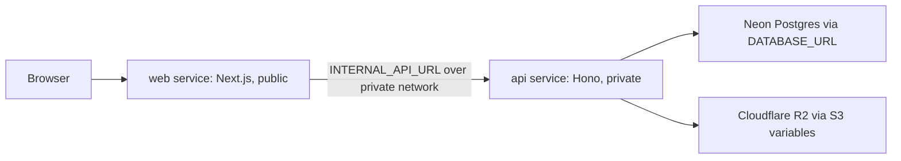

# Railway Deployment Plan

Goal: deploy this app on Railway while keeping Neon Postgres and Cloudflare R2 exactly as the external database and object storage providers.

## Recommended Shape

Use two Railway services from the same Bun monorepo:



- `web`: public Railway service. Attach the Railway/public custom domain here.
- `api`: private Railway service. Do not expose a public domain unless debugging requires it temporarily.
- Neon remains external. Do not create Railway Postgres.
- R2 remains external. Do not create Railway volumes or object storage.
- CLI: published to npm as the main agent-facing surface. It should talk to the public web origin, which then proxies API and MCP traffic to the private API.

This keeps the current architecture intact. The web app already proxies `/api/*`, `/mcp`, OAuth discovery, and agent identity routes to `INTERNAL_API_URL` in `apps/web/next.config.ts`.

## Domain

Canonical domain: `hostartifacts.dev`, purchased directly through Railway (Account/Workspace Settings -> Domains). Because Railway is the registrar and DNS provider, there is no external registrar, no manual DNS records, and no certificate setup. Railway manages DNS and issues TLS automatically once the domain is connected to a service.

| Host | Points at | Purpose |
| --- | --- | --- |
| `hostartifacts.dev` | Railway `web` service | App, API gateway, `/mcp`, OAuth, CLI target |

- The apex `hostartifacts.dev` is the only public origin. The `api` service stays private.
- Everything (browser, CLI, MCP clients, Dodo webhooks, Google OAuth) talks to `https://hostartifacts.dev`.

### Connect the Railway-purchased domain

In the screenshot the domain shows `Not connected`. Connect it to the public `web` service:

1. Open the `web` service -> Settings -> Networking (Public Networking).
2. Choose Custom Domain and select `hostartifacts.dev` from the Railway-owned domains.
3. Railway auto-creates the DNS records for its own managed domain and provisions the TLS certificate. No CNAME/A record copying is required.
4. Wait until the domain status shows connected/active and HTTPS is live.
5. Do not connect this domain (or any public domain) to the `api` service. The API stays private.

Optional `www` redirect: if you also want `www.hostartifacts.dev`, add it as a second custom domain on the `web` service and redirect it to the apex.

### Docs host

Docs are served at `https://docs.hostartifacts.dev`.

- Set `MINTLIFY_DOCS_URL` on the `web` service to the actual Mintlify origin for this project (the Mintlify-provided URL or a docs domain you configure in Mintlify).
- Add `docs.hostartifacts.dev` pointing to Mintlify or the docs proxy service, depending on where the docs are served.
- `apps/web/next.config.ts` defaults production docs rewrites to `https://docs.hostartifacts.dev`, but set `MINTLIFY_DOCS_URL` explicitly when proxying to a Mintlify-provided origin.

## Keep It Railway-Native

Prefer Railway's normal GitHub monorepo import and builder flow.

- Let Railway install dependencies. Do not put `bun install` inside custom build commands.
- Use service settings first. Do not add `railway.toml` files until the first deploy is stable.
- Do not configure watch paths initially. Add them later only if rebuild noise becomes annoying.
- Do not use the Dockerfiles for Railway unless the Railway builder fails. The existing Dockerfiles can remain for self-hosting or local container tests.

## Minimal Repo Change

Add a production start script to `apps/web/package.json`:

```json
"start": "next start"
```

The API already has:

```json
"start": "node dist/server.js"
```

Keep `apps/api/src/server.ts` unchanged initially. It already reads `process.env.PORT`. If Railway health checks cannot reach the API, then explicitly pass `hostname: "0.0.0.0"` to Hono's `serve()` as a small follow-up fix.

## Railway Services

Create or keep two services from the same GitHub repo:

1. `web`
2. `api`

Use the repo root as the source for both services so workspace packages are available.

If Railway's monorepo detection does not infer commands correctly, set these manually.

API service:

```bash
bun run --filter @agent-artifacts/api build
bun run --filter @agent-artifacts/api start
```

API pre-deploy command:

```bash
bun run --filter @agent-artifacts/db db:migrate
```

Web service:

```bash
bun run --filter @agent-artifacts/web build
bun run --filter @agent-artifacts/web start
```

Health checks:

- API: `/health`
- Web: `/`

## Networking

Keep only the web service public.

Set this on the API service:

```bash
PORT=3001
```

Set this on the web service:

```bash
INTERNAL_API_URL=http://${{api.RAILWAY_PRIVATE_DOMAIN}}:3001
```

Pinning the API port keeps the private URL simple and predictable. Do not set `PORT` on the web service; Next should use Railway's injected public service port.

## Required Environment Variables

Set these first. Add optional billing provider keys, Better Stack, and other integrations only after the first deploy is green.

Both services:

```bash
NODE_ENV=production
PUBLIC_APP_URL=https://hostartifacts.dev
NEXT_PUBLIC_APP_URL=https://hostartifacts.dev
BETTER_AUTH_URL=https://hostartifacts.dev
```

API service only:

```bash
DATABASE_URL=<existing Neon connection string>
BETTER_AUTH_SECRET=<32+ character secret>
GOOGLE_CLIENT_ID=<google oauth client id>
GOOGLE_CLIENT_SECRET=<google oauth client secret>
S3_ENDPOINT=https://<account-id>.r2.cloudflarestorage.com
S3_BUCKET=<r2 bucket>
S3_REGION=auto
S3_ACCESS_KEY_ID=<r2 access key>
S3_SECRET_ACCESS_KEY=<r2 secret key>
TRUST_PROXY=true
ENABLE_BILLING_CRON=true
```

Web service only:

```bash
INTERNAL_API_URL=http://${{api.RAILWAY_PRIVATE_DOMAIN}}:3001
```

Optional later:

```bash
AGENT_ARTIFACTS_BASE_URL=https://hostartifacts.dev
AGENT_ARTIFACTS_WEB_URL=https://hostartifacts.dev
MINTLIFY_DOCS_URL=https://docs.hostartifacts.dev
NEXT_PUBLIC_DOCS_URL=https://docs.hostartifacts.dev
DODO_PAYMENTS_API_KEY=...
DODO_PAYMENTS_WEBHOOK_SECRET=...
DODO_PAYMENTS_ENVIRONMENT=test_mode
DODO_BUILDER_PRODUCT_ID=...
DODO_STUDIO_PRODUCT_ID=...
BILLING_CRON_SECRET=...
BETTER_STACK_SOURCE_TOKEN=...
BETTER_STACK_WEB_SOURCE_TOKEN=...
NEXT_PUBLIC_BETTER_STACK_SOURCE_TOKEN=...
```

## Neon Postgres

Use the existing Neon `DATABASE_URL` on the API service.

Keep `sslmode=require` in the connection string.

Do not add Railway Postgres.

The database package already uses a small Postgres pool, so this is a good fit for Neon. If the API is later scaled to multiple replicas, check Neon connection limits because each API process can open several connections.

## Cloudflare R2

Use the existing R2 S3-compatible credentials on the API service only.

Do not add Railway storage or persistent volumes. Artifact content should continue to live in R2.

## Billing Scheduler

Use the in-process scheduler for now:

```bash
ENABLE_BILLING_CRON=true
```

The scheduler uses a Postgres advisory lock, so it is safe if the API later has more than one replica. Only one process should win the lock for a run.

Do not create a Railway cron service initially. That is extra moving parts and not needed for the current goal.

## External Integrations

After the web domain is live, update:

- Google OAuth redirect URL: `https://hostartifacts.dev/api/auth/callback/google`
- Dodo webhook URL, if billing is enabled: `https://hostartifacts.dev/api/webhooks/dodo`
- MCP clients: `https://hostartifacts.dev/mcp`
- CLI defaults or environment: use the web origin, not a separate API origin

## CLI And npm Launch

The CLI is the main product surface for agents. Treat npm publishing as part of launch, not a separate later chore.

The published CLI must default to the public web origin:

```bash
AGENT_ARTIFACTS_BASE_URL=https://hostartifacts.dev
AGENT_ARTIFACTS_WEB_URL=https://hostartifacts.dev
```

Do not bake the Railway private API URL into the npm CLI. External agents cannot reach `api.railway.internal`, and the public web service already proxies API and MCP requests.

Before publishing, fix or verify npm packaging:

- `apps/cli/package.json` currently publishes only `dist` and exposes `artifacts` from `dist/cli.js`.
- The TypeScript CLI imports private workspace packages such as `@agent-artifacts/artifact`, `@agent-artifacts/config`, and `@agent-artifacts/workspace`.
- A plain `tsc` build may leave those imports in `dist`, which will not work from npm unless those packages are also published.
- The simple launch path is to bundle the CLI for npm so internal workspace code is included in `dist/cli.js`, or otherwise publish every required workspace package intentionally.
- The public CLI release should stay Node-compatible so users do not need Bun installed to run `artifacts`.

Recommended npm release flow:

1. Build a production CLI package with both base and web URLs set to `https://hostartifacts.dev`.
2. Verify the generated package with `npm pack --dry-run`.
3. Install the packed tarball in a clean temporary directory.
4. Run `artifacts schema --format json`.
5. Run `artifacts setup` against production.
6. Run `artifacts whoami`.
7. Push, read, update, and share a small test artifact through the CLI.
8. Publish `@agent-artifacts/cli` to npm only after the clean install test passes.

Document the public installer clearly:

```bash
curl -fsSL hostartifacts.dev/install.sh | sh
```

This downloads the Node-based CLI asset and installs the `agent-artifacts` skill for supported local agents through Vercel's `skills` CLI.

Document skill-only installation separately:

```bash
npx skills add https://github.com/laxman-patel/agent-artifacts --skill agent-artifacts --agent '*' --global --copy -y
```

Only advertise npm package installation if it works on a clean machine without requiring workspace packages or Bun runtime assumptions.

## First Deploy Sequence

1. Add the web `start` script.
2. Import the repo into Railway.
3. Keep two services: public `web`, private `api`.
4. Set the minimal variables above.
5. Deploy `api` first and let the pre-deploy migration run against Neon.
6. Deploy `web`.
7. Verify web can reach API through `INTERNAL_API_URL`.
8. Connect the Railway-purchased `hostartifacts.dev` to the `web` service (DNS and TLS are automatic).
9. Update `PUBLIC_APP_URL`, `NEXT_PUBLIC_APP_URL`, and `BETTER_AUTH_URL` to the final domain.
10. Update Google OAuth redirect settings.
11. Smoke test sign-in, artifact upload, artifact readback, and `/mcp`.
12. Build and test the npm CLI package against the public web origin.
13. Publish the CLI to npm only after clean-install verification passes.

## Pre-Launch Checklist

Before opening the app to the public, verify these items.

### Domain And HTTPS

- `hostartifacts.dev` (purchased via Railway) is connected to the `web` service and shows connected/active, not `Not connected`.
- HTTPS certificate is issued and valid (auto-provisioned by Railway).
- Domain auto-renew is on (visible in Railway Domains settings).
- `PUBLIC_APP_URL`, `NEXT_PUBLIC_APP_URL`, and `BETTER_AUTH_URL` exactly match `https://hostartifacts.dev`.
- No public URL is assigned to the private `api` service.

### Authentication

- `BETTER_AUTH_SECRET` is a strong 32+ character production secret.
- Google OAuth has the production redirect URL: `https://hostartifacts.dev/api/auth/callback/google`.
- Sign-in works from a fresh browser session.
- Sign-out works and clears the session.
- Auth callback does not redirect to localhost or a Railway preview URL.

### Database

- `DATABASE_URL` points to the intended Neon production database, not a local or staging database.
- Migrations have run successfully in the API pre-deploy step.
- Neon SSL is enabled with `sslmode=require`.
- Neon connection limits are safe for the current API replica count.
- A backup or restore point exists before launch.

### Object Storage

- R2 credentials belong to the production bucket.
- The API can write, read, sign, and delete test artifact objects.
- Bucket permissions are not public unless explicitly intended.
- Test objects created during smoke testing are cleaned up if needed.

### Railway Configuration

- `web` and `api` deploy from the expected GitHub branch.
- API service is private-only and reachable from web through `INTERNAL_API_URL`.
- API health check `/health` passes.
- Web health check `/` passes.
- Web service has no manually pinned `PORT`.
- API service has `PORT=3001` if `INTERNAL_API_URL` uses `:3001`.
- `TRUST_PROXY=true` is set on the API service.

### Billing And Paid Features

- If billing is live, Dodo keys are production keys and `DODO_PAYMENTS_ENVIRONMENT` is correct.
- Dodo webhook points to `https://hostartifacts.dev/api/webhooks/dodo`.
- Dodo webhook signing secret is set on the API service.
- `ENABLE_BILLING_CRON=true` is set only where intended.
- Billing cron startup is visible in API logs.
- Product IDs match the products configured in Dodo.

### Security And Secrets

- No `.env` file or production secret is committed to git.
- Railway secrets are scoped only to services that need them.
- R2 secret key, Better Auth secret, Google secret, Dodo secret, and Neon URL are not exposed to the web service unless needed.
- CORS, CSRF, and auth flows work only for the production origin.
- Rate limiting uses the database store in production, or the chosen single-instance fallback is intentional.

### Product Smoke Tests

- User can sign in with Google.
- User can create an artifact.
- User can view the latest artifact version.
- User can update an artifact and view version history.
- Sharing and permission behavior works for private and shared artifacts.
- Rendered HTML, Markdown, and JSX artifact types behave as expected.
- `/mcp` is reachable from the public web origin.
- CLI can point at the public web origin and complete login or token-based access.

### CLI And npm Package

- CLI production defaults are the public web origin for both API base and browser login.
- CLI does not default to localhost, Railway private DNS, or an internal API URL.
- Published package installs in a clean directory.
- Published package does not depend on unpublished/private workspace packages.
- `artifacts schema --format json` works after clean install.
- `artifacts setup` prints MCP client configuration for `https://hostartifacts.dev/mcp`.
- `artifacts login`, `artifacts whoami`, and token-based non-interactive mode work.
- Core agent workflow works through the CLI: push artifact, read artifact, update artifact, create share link.
- Docs show the correct install command and mention Bun if the CLI remains Bun-based.
- The npm package name, version, license, repository, README, and `bin` entry are correct before publishing.

### Observability And Operations

- Railway logs are clean after boot.
- API errors are visible in logs.
- Optional Better Stack log tokens are configured if you want external log aggregation at launch.
- External uptime monitor checks the web root.
- You know where to see failed deploys, pre-deploy migration failures, and runtime logs in Railway.

### Public Launch Readiness

- Landing page, docs link, pricing/billing copy, and support/contact routes are accurate.
- Legal links, privacy policy, and terms are present if required.
- Test accounts, test products, and test webhook endpoints are not visible in production.
- The first production admin/operator account has been created and verified.
- Rollback path is understood: redeploy previous Railway deployment or revert the GitHub commit.

## Later Hardening

Do these after the first working deploy:

- Add watch paths for faster monorepo deploys.
- Move Railway settings into config-as-code if you want reviewable deployment config.
- Add Better Stack logs and external uptime checks.
- Add staging with a separate Neon branch and R2 bucket or prefix.
- Review Neon connection usage before increasing API replicas.
- Make the CLI release process reproducible in CI once the first npm publish is proven manually.
