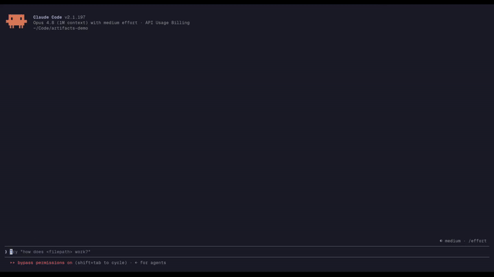

<p align="center">
	
</p>

<h1 align="center">Artifacts</h1>

<p align="center">
	Give every HTML report, Markdown spec, and JSX prototype your agents produce a permanent, versioned, access-controlled URL.
</p>

<p align="center">
	<a href="https://hostartifacts.dev">Website</a>
	 |
	<a href="https://hostartifacts.dev/install.sh">CLI</a>
	 |
	<a href="https://docs.hostartifacts.dev">Docs</a>
	 |
	<a href="https://hostartifacts.dev/pricing">Pricing</a>
	 |
	<a href="https://github.com/laxman-patel/agent-artifacts">GitHub</a>
</p>

<p align="center">
	<a href="https://github.com/laxman-patel/agent-artifacts/releases/download/demo-assets/artifacts-demo-video.mp4">
		
	</a>
</p>

Agents produce real work now — HTML reports, Markdown specs, JSX prototypes, review surfaces, one-off tools. Artifacts gives that work a home: publish it once and get a permanent URL with version history, access controls, and the same authorization model across the web app, CLI, REST API, and MCP server.

## How it works

1. **Publish content.** Send an HTML, Markdown, or JSX file from the CLI, REST API, or an MCP tool. The first publish creates an artifact and its version 1.
2. **Get a durable URL.** Each artifact lives at a stable path and renders safely in the browser — sandboxed HTML, sanitized Markdown, or the Preact runtime for JSX.
3. **Update without losing history.** Every update appends a new immutable version. Old versions stay addressable, so you can diff or restore them anytime.
4. **Share with the right people.** Keep it public, private, email-allowlisted, or behind a scoped share link — without ever changing the URL.

Every artifact lives at a path like `https://hostartifacts.dev/{workspace}/{project}/{artifact}`.

## What you can publish

| Type | Use it for | How it renders |
| --- | --- | --- |
| `html` | Reports, dashboards, mockups | Sandboxed HTML with browser isolation |
| `md` | Specs, notes, research writeups | Sanitized, GitHub-flavored Markdown |
| `jsx` | Prototypes, interactive explainers | Preact-compatible runtime |

The same artifact model is available four ways: the [web app](https://hostartifacts.dev), the [CLI](https://hostartifacts.dev/install.sh), the REST API, and an MCP server for agents like Cursor and Claude Code.

## Get started

```bash
curl -fsSL https://hostartifacts.dev/install.sh | sh
artifacts login
artifacts push --project-slug default --file ./report.md
```

`push` returns a hosted URL. Open it, share it, or update it — each push appends a new version.

## Self-host

Artifacts is a Bun + Turborepo monorepo (Next.js web app, Hono API, Drizzle, Postgres, S3-compatible storage). Run the full stack yourself with Docker or [Railway](https://railway.com).

```bash
bun install
cp .env.example .env
bun run db:migrate
bun run dev
```

See the [deployment guide](https://docs.hostartifacts.dev) and [RAILWAY_DEPLOYMENT_PLAN.md](RAILWAY_DEPLOYMENT_PLAN.md) for the details.

## Contributing

Issues, pull requests, and docs fixes welcome. Read the [docs](https://docs.hostartifacts.dev) before changing user-facing behavior, and see [PLAN.md](PLAN.md) and [ABOUT.md](ABOUT.md) for product context.
